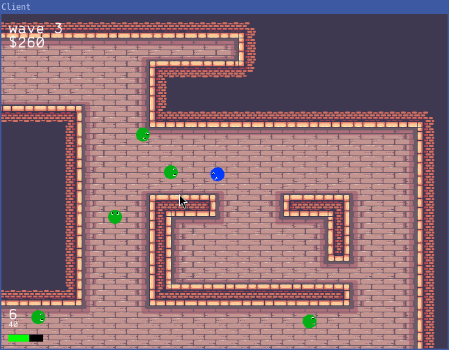

# DualStick



**DualStick** is a online multiplayer, 2D cooperative shooter game currently in development. Players team up to shoot down waves of increasingly difficult enemies.
This game is built from scratch using C++ with SDL2 for rendering and ENet for networking.

## Getting Started

### Prerequisites

To build and run DualStick, you will need:

- **SDL2**: For rendering graphics.
- **ENet**: For networking communication.
- **Make**: For building the project.

### Building the Project

1. **Build the Server**

```bash
  make -C server
```

2. Build the Client

```bash
  make -C client
```

### Running the Game

You need to first have one instance of the server running :

```bash
  cd server
  ./s
```

Then run the client:

```bash
  cd client
  ./c <server-ip>
```

**Note:** Replace `<server-ip>` with the IP address of the server, or leave empty for localhost.

## Controls

- **WASD**: Move the player.
- **Mouse**: Aim the player.
- **Space**: Shoot bullets.
- **E**: Buy in shops.
- **R**: Reload the gun.

## Map Editor

You can modify the map with the python script `assets/editor.py`.
Only the server need the map file, the client will download it automatically.

```bash
  python3 assets/editor.py
```

## Upcoming Features

- **Enemy Flock Behavior**: Implement AI behaviors for enemy formations and group dynamics.
- **Lobby System**: Design and implement a multiplayer lobby system.
- **Server CLI**: Create a command-line interface for managing the server.
- **Improved Map Editor**: Enhance the map editor with additional features and user-friendly tools.
- **Weapon Switching**: Enable players to change weapons during gameplay.
- **Wave System**: Introduce waves of enemies to increase difficulty over time.
- **Economy System**: Add a money system for in-game purchases and upgrades.
- **Unlockable Map Portions**: Create a system for unlocking new areas of the map as players progress.
- **Score System**: Implement a scoring system to track player performance.
- **Menus**: Develop a main menu, pause menu, and settings menu.
- **HUD Overhaul**: Improve the overall design and functionality of the Heads-Up Display (HUD).
